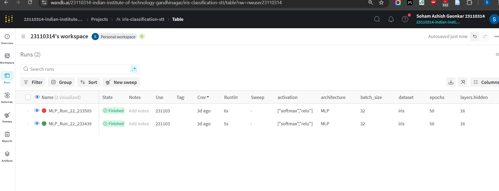
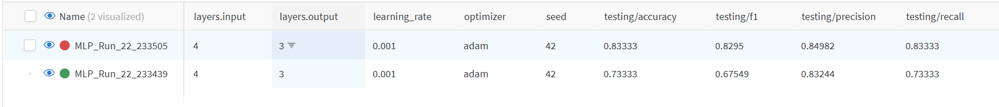
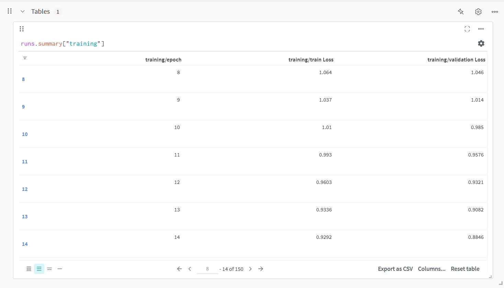
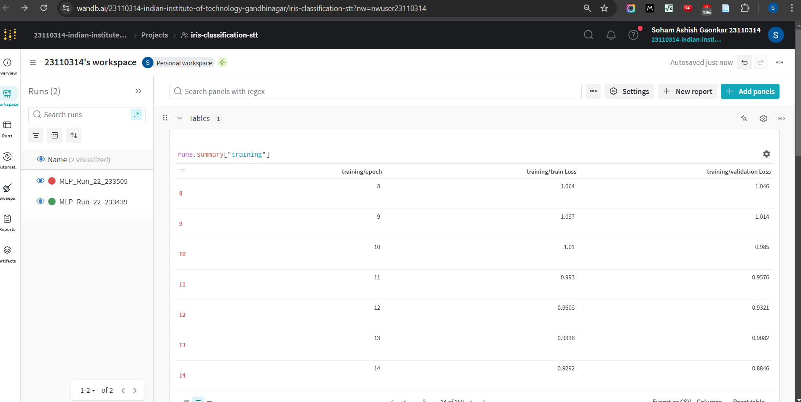
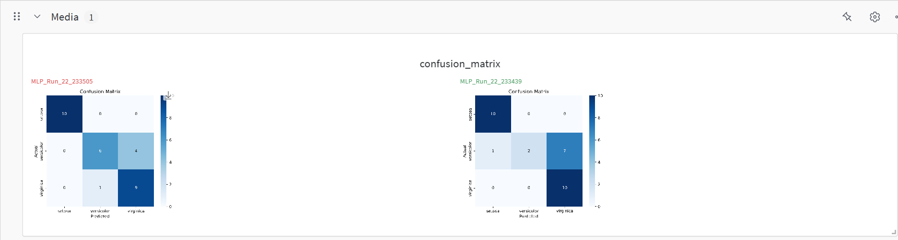
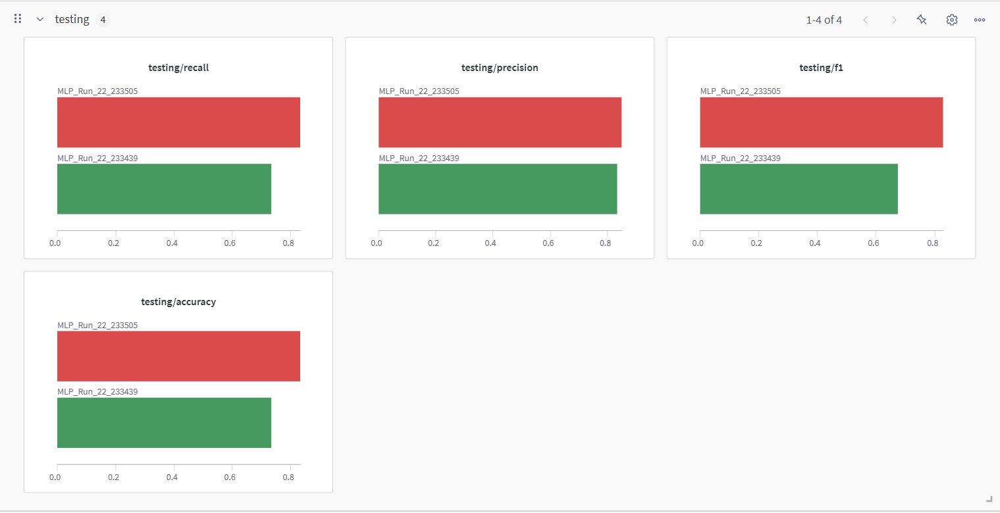
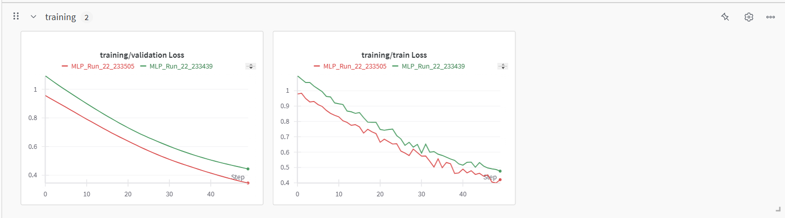

# STT Lab 06 - Weights & Biases and Autogluon

## Group 7

| Name              | ID         |
|------------------|-----------|
| Soham Gaonkar   | 23110314   |
| Chaitanya Sharma | 23110072   |

---

## Section 1: Weights & Biases

**1. Training hyperparameters:**  

**2. Model architecture:**  

**3. Training and testing metrics:**  

**4. Training and validation loss table:**  

**5. Confusion matrix:**  

**6. Evaluation metrics:**  

**7. Graphs of training and validation loss:**  

---
